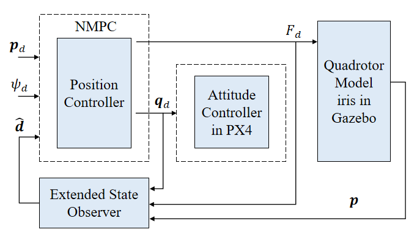
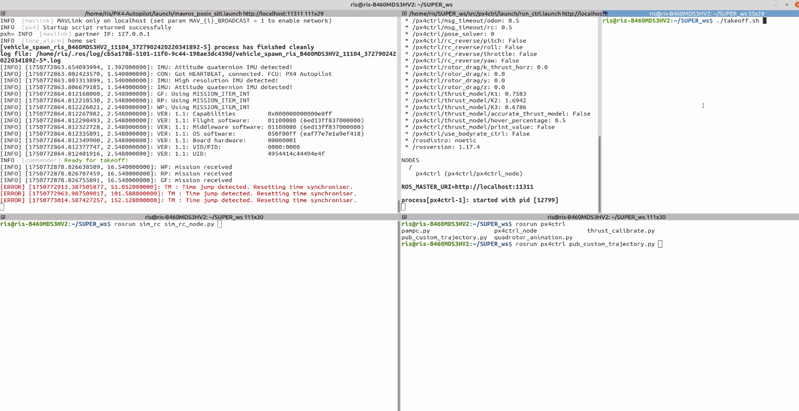
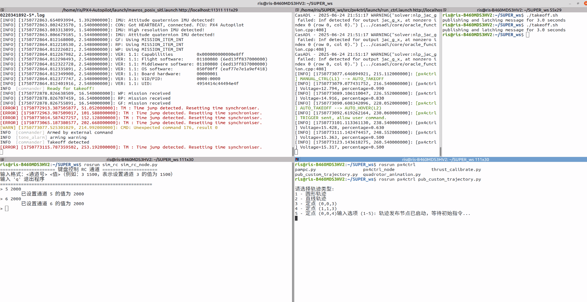

<div align="center">
    <h1>ESO-based NMPC Controller for PX4</h1>
    <br>
    <a href="https://github.com/thecatinbed" target="_blank">Rongqin Mo</a>
    <br>
    <br>
    <div class="text-center">
        
    </div>
    <br>
    <a href='https://arxiv.org'></a>  
    <a href="https://www.bilibili.com"></a>  
    <a href="https://www.youtube.com"></a>
</div>

# 1 Updates
* **Jun. 24, 2025** - Initial release of ESO-NMPC controller

# 2 Description
Nonlinear model predictive control(NMPC) with Extended State Observer(ESO) for robust quadrotor control, built on PX4 autopilot framework.

## Project Structure
```
src/
├─ px4ctrl/             # ESO-NMPC controller core
├─ sim_rc/              # Remote control simulator
│ └─ sim_rc_node        # Gazebo RC simulation node
├─ utils/               # Dependency packages
│ ├─ cmake_utils/       # CMake configuration utilities
│ ├─ quadrotor_msgs/    # Custom quadrotor messages
│ └─ uav_utils/         # UAV operation utilities
└─ launch/              # ROS launch files
└─ run_ctrl.launch      # Controller launch configuration
takeoff.sh              # Automatic takeoff script
takeland.sh             # Automatic takeland script
```

# 3 Architecture
<center>
  
</center>

# 4 Installation

## Dependencies
```bash
# ROS Noetic (recommended)
sudo apt install ros-noetic-desktop-full

# Required ROS packages
sudo apt install ros-noetic-mavros ros-noetic-gazebo-ros
```
## Build Instructions
```bash
mkdir -p mpc_ws/src
cd mpc_ws/src
git clone https://github.com/yourrepo/eso_mpc_controller.git
cd ..
catkin_make
source devel/setup.bash
```
# 5 Usage
## 5.1 Launch Controller
```bash
roslaunch px4ctrl run_ctrl.launch
```
Controller will initialize and wait for RC input.

## 5.2 Simulate RC
```bash
rosrun sim_rc sim_rc_node
```
Provides fake RC input for Gazebo simulation environment.

## 5.3 Automatic Takeoff Procedure
1. Execute takeoff script:
```bash
./takeoff.sh
```
2. When controller reports channel issue:
* Set RC channel 5 = 2000 (bottom position)
* Set RC channel 6 = 2000 (bottom position)
3. After "ready for re-takeoff" prompt:
```bash
./takeoff.sh
```
Quadrotor will execute autonomous takeoff sequence.

# 6 Simulation Results
## 6.1 Auto Takeoff
<center>

</center>

## 6.2 Circular Trajectory Tracking
<center>

</center>


